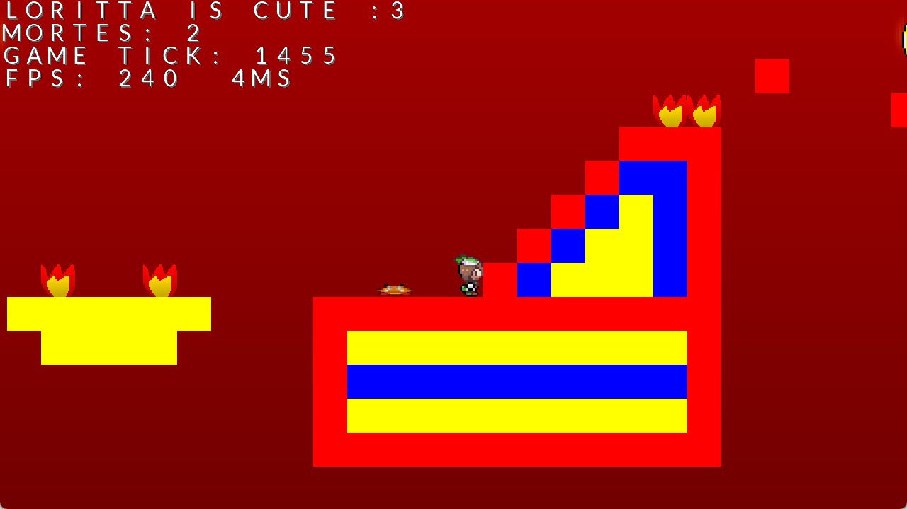

<h1 align="center">🏃 2D Game Hard (Kotlin) 🏃</h1>

A remake of the [2D Game Hard](https://mrpowergamerbr.com/br/projects/2d-game-hard/) game series in Kotlin, in specific, it is based on the "[2D Game Hard (Advanced)](https://mrpowergamerbr.com/projects/2d-game-hard/advanced)" version.

This is not a full remake, nor it is an authentic remake, because this was meant as a "programming study"... After making [TotallyNotMario](https://github.com/MrPowerGamerBR/TotallyNotMario), I was so frustrated with making a game with LWJGL that I tried using GameMaker and Godot... After all, if everyone uses these engines, they must be good, right?

Well, after trying to use a proper engine, I got frustrated because it seems that no other engine works the way I want!

I always thought that the best way to make a game is to use fixed timestep, because that makes the game work in a deterministic manner no matter the player's FPS.

Well, GameMaker does not support that (it only supports variable timestep) and Godot, while it does support it via the `_physics_process` functions, they do not have any interpolation between frames.

Why does these popular engines do not support fixed timestep! Yeah, variable timestep is easy, until something goes haywire in the player's computer (like if it lags HARD) and the entire physics systems breaks!

So I went back, and I tried remaking one of my old games in LWJGL... and now... it was actually *enjoyable*?!

Now, that doesn't mean I didn't get stuck debugging some stupid things, but the game actually works *well* and it is fun to play!

By the way, the name of the project is `DDGameHard` because packages and classes can't start with numbers, whoops!

## Screenshots

